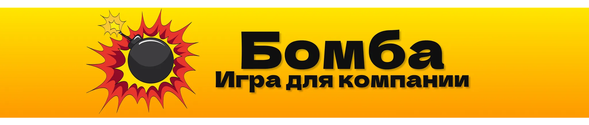
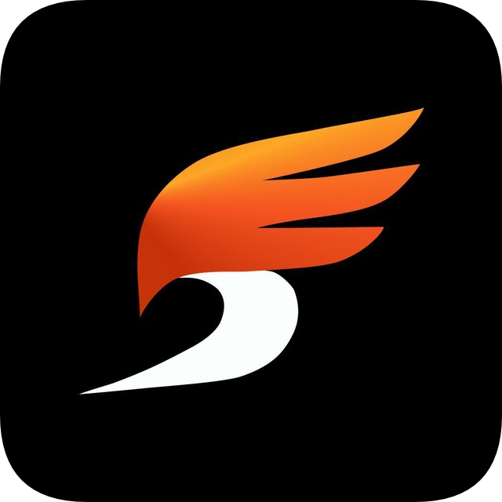
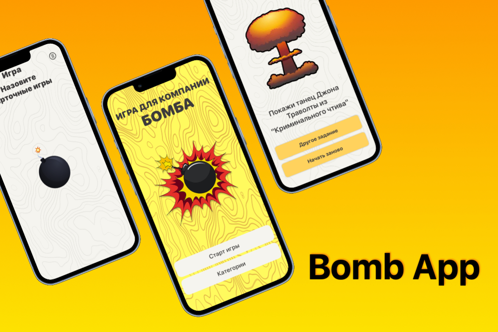
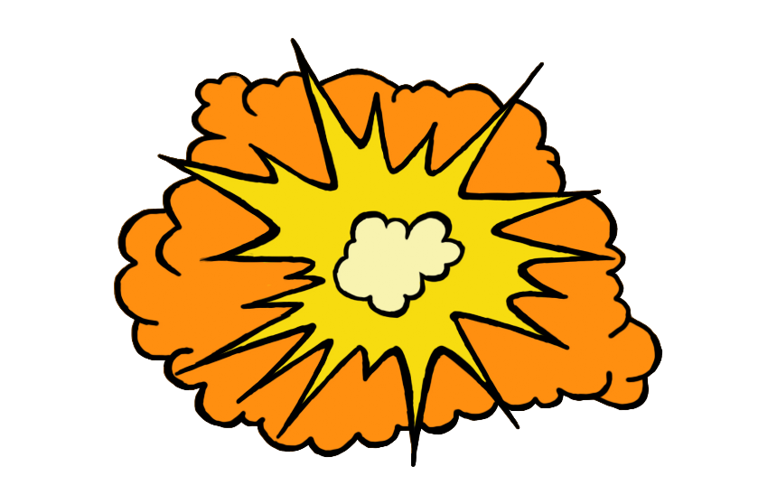

 

# Challenge 1: Bomb app  

- [:calling: About Challenge](#about)
- [:movie_camera: Capture The Boom: The Game is On!](#video)
- [:bomb: Who Will Boom Next? (ruuuuuules!)](#boom)  
- [:wrench: Technical Stack](#stack)  
- [:metal: Developers (team #10)](#developers)  

---

<h2 id="about">:calling: About Challenge</h2>

The app was created as part of the **[Devrush Swift Marathon XIV](https://devrush.ru/swiftmarathon)**, and it's the result of a great team effort!  
We hope you’ll enjoy using it as much as we enjoyed building it. 

 
Curious to learn more about the marathon? Check it out here: <a href="https://devrush.ru/swiftmarathon">Swift Marathon by Devrush</a>

 

[🔝 Back to Table of Contents](#challenge-1-bomb-app-)

---

<h2 id="video">:movie_camera: Capture The Boom: The Game is On!</h2>

[🔝 Back to Table of Contents](#challenge-1-bomb-app-)

---

<h2 id="boom">:bomb: Who Will Boom Next? (ruuuuuules!)</h2>

**Ready to have some fun with your friends?**

 
Let’s spice things up with a little game! Here’s how it works:

> :bomb: Gather your friends and stand in a circle  
> :bomb: The first player grabs the phone and taps the "Start Game" button  
> :bomb: A question will pop up on the screen, like: "Name a fruit"  
> :bomb: The player answers the question and passes the phone to the next person  
> :bomb: Keep answering the same question in turns as the phone goes around the circle—until the bomb explodes! :boom:  
> :bomb: Whoever’s holding the phone when the bomb goes off is the loser (or is it winner? :sunglasses:) and gets to complete a fun task!  

Let the chaos and laughter begin! :smiling_imp:  
[🔝 Back to Table of Contents](#challenge-1-bomb-app-)

---

<h2 id="stack">:wrench: Technical Stack:</h2>

The app is lovingly crafted using the magic of  `SwiftUI`! 

* MVVM
* Lottie
* AVFoundation
* iOS 16+

[🔝 Back to Table of Contents](#challenge-1-bomb-app-)

---

<h2 id="developers">:metal: Developers (team #10)</h2>

:star2: [Varya Utkina (teamleader :new_moon_with_face:)](https://github.com/VaryaUtkina)  
:star2: [DmitryLorents](https://github.com/DmitryLorents)  
:star2: [Nikita Moskalev](https://github.com/nikmosyl)  
:star2: [Sergey Zakurakin](https://github.com/SergeyZakurakin)  

[🔝 Back to Table of Contents](#challenge-1-bomb-app-)
